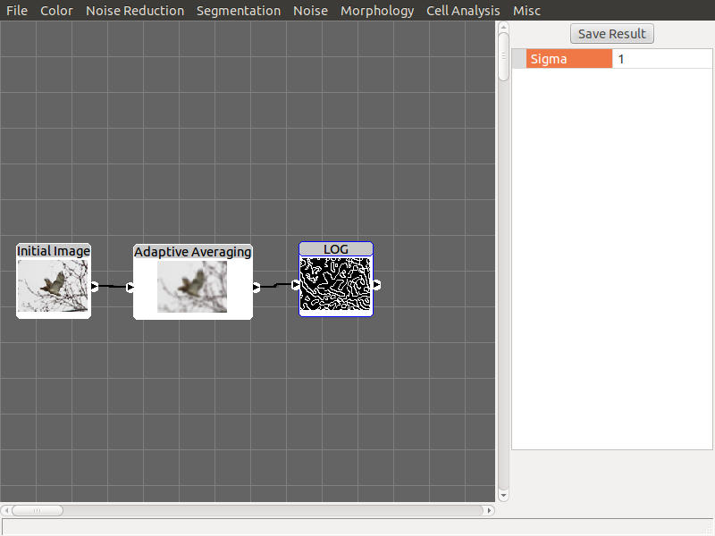

# Image Processing Toolkit - Archived

**WARNING**: This code almost certainly does not compile; even if you took the time to update everything to a more recent version of Visual Studio. It is here as illustrative evidence that I do know some stuff about image processing, analysis, and C++.

This project was originally created to make experimentation easier for my projects in CSCI 8810 and CSCI 8820 at UGA (2011-2013). A more advanced version off this application would go on to play an important role as an experimental testbed for my image processing and computer vision research projects and contributed to my unfinished thesis research.

This more advanced version of the application supported loading and saving graphs of nodes via [RapidXml](https://rapidxml.sourceforge.net/), [ITK](https://itk.org/) operation support, and Linux support, but has long since been lost and only this early version of the codebase survives.

A screenshot of this more advanced version does exist however:

